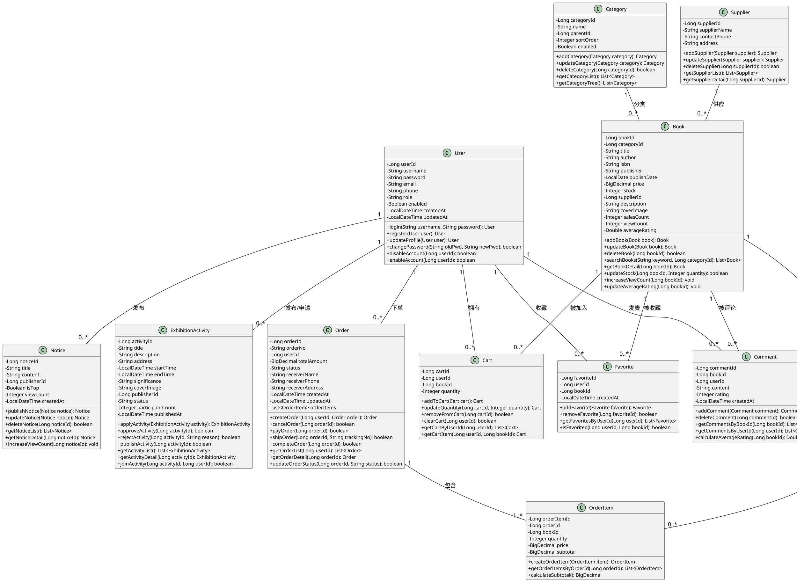
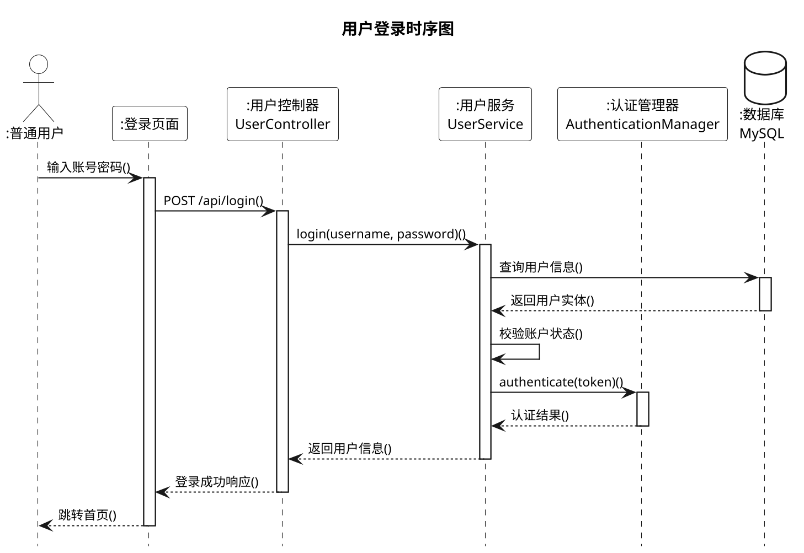
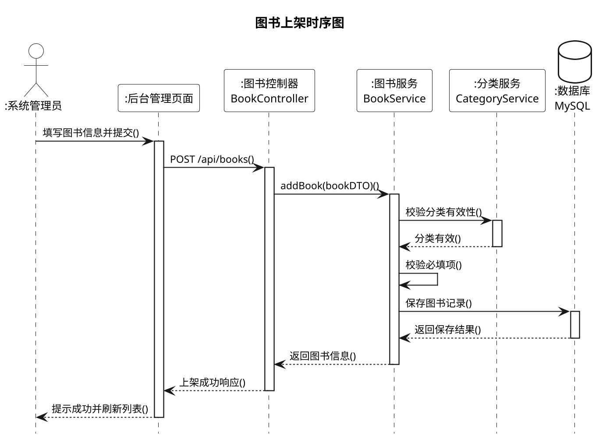
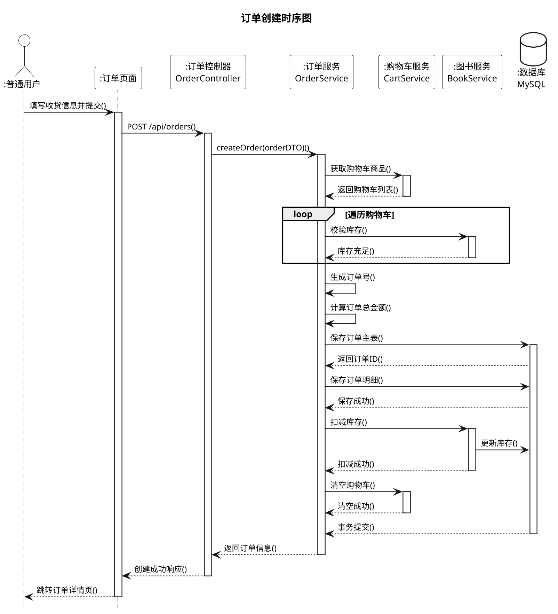
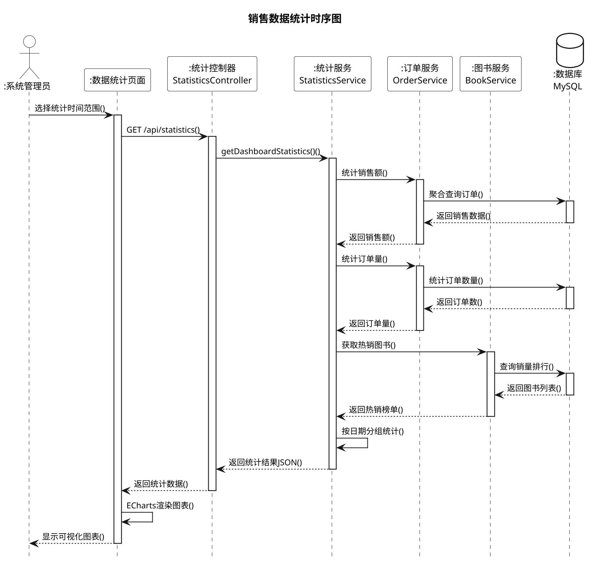
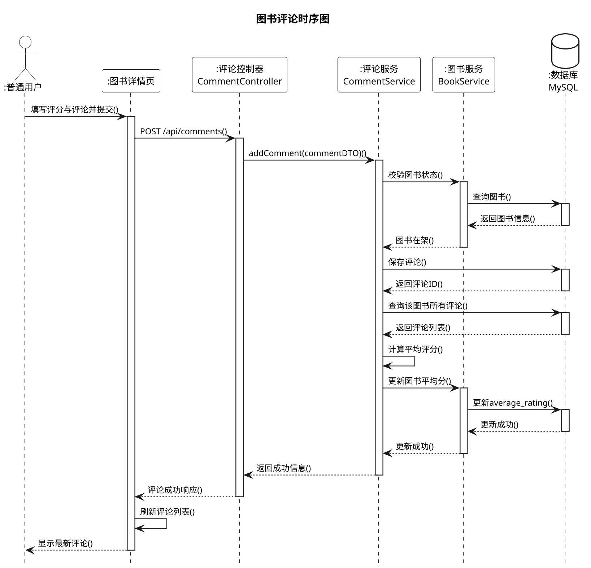
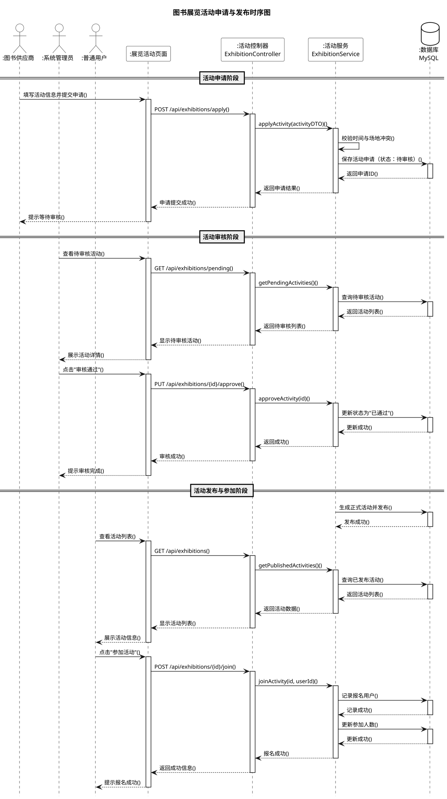

# 基于SpringBoot的图书展销平台设计与实现（修改版）

## 修改说明
本文档包含所有需要修改的图表的修改后描述和PlantUML代码，供您参考使用。

---

## 第3章 需求分析

### 3.1 业务需求

顶层数据流图展示了图书展销平台与系统管理员、普通用户与图书供应商之间的信息交互关系，如图3-1所示。

**【图3-1 修改要求】**
- "普通读者" → **"普通用户"**
- "评论图书" → **"图书评论"**
- "收藏/加入购物车" → **"购物车收藏加入"**（动词改名词）
- 字号：调小一点
- 线条：横线拉平，竖线垂直，保持美观

其中，系统管理员负责创建和维护图书分类信息、图书信息、公告资讯及用户信息、角色权限信息，并向平台获取销售统计信息、用户行为信息、订单信息，以支持其运营管理决策。

普通用户将订单信息、图书评论信息、购物车收藏加入信息提交至平台，同时从平台获取图书信息、订单状态、公告信息、个人信息及首页推荐信息，以支持其购书与互动需求。

图书供应商负责向平台提交图书信息、管理库存及处理订单发货，同时从平台获取订单状态与销售数据反馈，以支持其供货与运营决策。

**图 3-1 顶层数据流图（修改后）**

```
+----------------------------------------------------------+
|                    图书展销平台                           |
|  +----------------+  +----------------+  +-------------+ |
|  |   图书管理     |  |   交易管理     |  |  交互管理   | |
|  | - 分类信息     |  | - 订单信息     |  | - 图书评论  | |
|  | - 图书信息     |  | - 购物车       |  | - 购物车    | |
|  |                |  |                |  |   收藏加入  | |
|  +--------+-------+  +--------+-------+  +------+------+ |
|           |                   |                 |        |
+-----------|-------------------|-----------------|--------+
            |                   |                 |
+-----------+                   |                 +-----------+
|                               |                             |
v                               v                             v
+----------------+    +------------------+    +------------------+
|   系统管理员   |    |    普通用户      |    |   图书供应商     |
| - 维护分类信息 |    | - 提交订单信息   |    | - 提交图书信息   |
| - 维护图书信息 |    | - 提交图书评论   |    | - 管理库存       |
| - 维护用户信息 |    | - 提交购物车     |    | - 处理订单发货   |
| - 查看统计数据 |    |   收藏加入       |    | - 查看销售数据   |
+----------------+    +------------------+    +------------------+
```

---

### 3.2 用户需求

普通用户的核心用例为图书检索（多条件）、图书详情查看、购物车管理、订单提交与查询、图书评论/评分/收藏、个人信息维护，无系统管理与数据修改权限。

**图书供应商**的核心用例为图书信息录入与维护、库存管理、订单发货处理、销售数据查看及展览活动发布，拥有管理自身供应的图书及订单的权限。

系统管理员的核心用例为用户信息管理（启用/禁用、删除）、图书分类管理、图书信息管理（增删改查）、订单状态管理、系统数据统计与可视化、公告资讯发布，拥有平台最高级别的数据管理权限。系统用例图如3-4所示。

**【图3-4 修改要求】**
- "供应商" → **"图书供应商"**

**图 3-4 系统用例图（修改后）**

```
                    +------------------+
                    |    普通用户      |
                    +--------+---------+
                             |
            +----------------+----------------+
            |                |                |
            v                v                v
    +---------------+ +---------------+ +---------------+
    |   图书检索    | |   购物车管理  | |   订单管理    |
    |   查看详情    | |   收藏管理    | |   图书评论    |
    +---------------+ +---------------+ +---------------+

                    +------------------+
                    |   图书供应商     |  <-- 修改：加"图书"二字
                    +--------+---------+
                             |
            +----------------+----------------+
            |                |                |
            v                v                v
    +---------------+ +---------------+ +---------------+
    |   图书录入    | |   库存管理    | |   订单发货    |
    |   销售查看    | |   活动发布    | |               |
    +---------------+ +---------------+ +---------------+

                    +------------------+
                    |   系统管理员     |
                    +--------+---------+
                             |
    +----------------+-------+--------+----------------+
    |                |                |                |
    v                v                v                v
+--------+    +------------+    +------------+    +--------+
|用户管理|    | 图书管理   |    | 订单管理   |    |数据统计|
|公告管理|    | 分类管理   |    |            |    |可视化  |
+--------+    +------------+    +------------+    +--------+
```

---

## 第4章 系统设计

### 4.2 数据库设计

#### 4.2.1 概念模型设计

本系统有用户、图书、订单、供应商、购物车、评论、收藏、公告、订单明细9个核心实体。

**【图4-2至图4-10 修改要求】**
1. 所有方框中的**"表"字删除**（如"用户表"→"用户"）
2. 字号调小，与下方"图4-2用户实体属性图"这几个字大小差不多
3. 图4-2椭圆角色加上"ID"

用户实体是根据系统用户管理和权限控制的需求设计的，用于存储用户的基本信息和权限信息，如用户ID、用户名、密码、邮箱、手机号、角色等。用户实体使系统能够追踪和管理每个用户的资料、权限和角色，支持用户注册、登录和权限验证等功能。如图4-2所示。

**图 4-2 用户实体属性图（修改后）**

```
                    +------------------+
                    |       用户       |  <-- 删除"表"字
                    +------------------+
                    | - 用户ID         |  <-- 添加ID
                    | - 用户名         |
                    | - 密码           |
                    | - 邮箱           |
                    | - 手机号         |
                    | - 角色           |
                    | - 真实姓名       |
                    | - 地址           |
                    | - 是否启用       |
                    | - 创建时间       |
                    +------------------+
```

图书实体是根据图书展销平台的核心业务需求设计的，其记录了图书的详细信息，如图书ID、书名、作者、ISBN、价格、库存、供应商ID等。此实体帮助系统有效管理图书信息，支持图书的展示、检索、库存管理和销售统计等功能。如图4-3所示。

**图 4-3 图书实体属性图（修改后）**

```
                    +------------------+
                    |       图书       |  <-- 删除"表"字
                    +------------------+
                    | - 图书ID         |
                    | - 书名           |
                    | - 作者           |
                    | - ISBN           |
                    | - 出版社         |
                    | - 出版日期       |
                    | - 价格           |
                    | - 库存           |
                    | - 供应商ID       |
                    | - 简介           |
                    | - 封面图         |
                    | - 销量           |
                    | - 浏览量         |
                    | - 平均评分       |
                    +------------------+
```

订单实体是根据在线交易和订单管理的需求设计的，用于存储订单的完整信息，如订单ID、订单号、用户ID、总金额、订单状态等。订单实体使系统能够追踪每个订单的完整生命周期，从创建、支付、发货到完成或取消，确保交易过程的完整性和可追溯性。如图4-4所示。

**图 4-4 订单实体属性图（修改后）**

```
                    +------------------+
                    |       订单       |  <-- 删除"表"字
                    +------------------+
                    | - 订单ID         |
                    | - 订单号         |
                    | - 用户ID         |
                    | - 总金额         |
                    | - 订单状态       |
                    | - 收货人姓名     |
                    | - 收货电话       |
                    | - 收货地址       |
                    | - 创建时间       |
                    +------------------+
```

供应商是系统中用于管理图书供货来源的实体，包含供应商ID、供应商名称、联系电话和供应商地址四个属性，其中供应商ID为唯一标识主键，该实体通过一对多关系与图书关联，为图书采购、库存溯源等业务提供基础数据支撑。如图4-5所示。

**图 4-5 供应商实体属性图（修改后）**

```
                    +------------------+
                    |     供应商       |  <-- 删除"表"字
                    +------------------+
                    | - 供应商ID       |
                    | - 供应商名称     |
                    | - 联系电话       |
                    | - 供应商地址     |
                    +------------------+
```

购物车实体是依据用户购物体验和订单准备的需求设计的，用于存储用户待购买的商品信息，如购物车ID、用户ID、图书ID、数量等。购物车实体使用户能够方便地管理待购买的商品，支持商品的添加、删除、数量修改等操作，为订单创建提供便利。如图4-6所示。

**图 4-6 购物车实体属性图（修改后）**

```
                    +------------------+
                    |      购物车      |  <-- 删除"表"字
                    +------------------+
                    | - 购物车ID       |
                    | - 用户ID         |
                    | - 图书ID         |
                    | - 数量           |
                    +------------------+
```

评论实体是基于用户反馈和图书评价的需求设计的，用于存储用户对图书的评价信息，如评论ID、图书ID、用户ID、评论内容、评分、创建时间等。评论实体帮助系统收集和管理用户对图书的评价，为其他用户提供购买参考，同时支持图书评分统计和平均分计算。如图4-7所示。

**图 4-7 评论实体属性图（修改后）**

```
                    +------------------+
                    |       评论       |  <-- 删除"表"字
                    +------------------+
                    | - 评论ID         |
                    | - 图书ID         |
                    | - 用户ID         |
                    | - 评论内容       |
                    | - 评分           |
                    | - 创建时间       |
                    +------------------+
```

收藏实体用于存储用户收藏的图书信息，如收藏ID、用户ID、图书ID、创建时间等。收藏实体使用户能够将感兴趣的图书添加到个人收藏夹中，方便后续查看和购买，提升用户体验。如图4-8所示。

**图 4-8 收藏实体属性图（修改后）**

```
                    +------------------+
                    |       收藏       |  <-- 删除"表"字
                    +------------------+
                    | - 收藏ID         |
                    | - 用户ID         |
                    | - 图书ID         |
                    | - 创建时间       |
                    +------------------+
```

公告实体是依据系统通信和用户交互的需求设计的，用于存储发送给用户的通知和公告信息，如公告ID、标题、内容、发布人ID、是否置顶、浏览量等。公告实体确保用户能够及时收到平台的重要通知、活动信息和系统消息，提升用户与平台的互动性。如图4-9所示。

**图 4-9 公告实体属性图（修改后）**

```
                    +------------------+
                    |       公告       |  <-- 删除"表"字
                    +------------------+
                    | - 公告ID         |
                    | - 标题           |
                    | - 内容           |
                    | - 发布人ID       |
                    | - 是否置顶       |
                    | - 浏览量         |
                    +------------------+
```

订单明细是实现订单与图书多对多关联的核心中间实体，以明细ID为唯一主键，记录订单中每本图书对应的订单ID、图书ID、购买数量及小计金额等关键信息，不仅支撑订单总金额的自动核算，也为订单商品溯源、库存扣减及售后管理提供了精准可靠的数据依据，是保障订单业务完整性与可追溯性的重要数据载体。如图4-10所示。

**图 4-10 订单明细实体属性图（修改后）**

```
                    +------------------+
                    |     订单明细     |  <-- 删除"表"字
                    +------------------+
                    | - 明细ID         |
                    | - 订单ID         |
                    | - 图书ID         |
                    | - 购买数量       |
                    | - 小计金额       |
                    +------------------+
```

系统总体E-R图如图4-11所示。

### 4.3 系统类图设计

**【图4-11 修改要求】**
1. 只有属性没有方法，需要**加上方法**
2. 字号要放大

类图在图书展销平台中通过可视化方式系统性地定义了核心业务对象及其关系，为开发与协作提供清晰的技术蓝图，并将业务需求转化为具体的类结构。

**图 4-11 图书展销平台类图（修改后，添加方法）**



### 4.4 功能模块设计

**【图4-12 修改要求】**
1. 最右边"交互与社区管理"下面的"个性化推荐" → **"展览活动申请与发布"**
2. 字号大一点

图书展销平台通过分层架构设计，清晰划分不同功能模块及其子功能，满足图书展销全流程需求。平台顶层包含用户与权限管理、图书信息与分类管理、图书交易管理、平台运营与数据分析、交互与社区管理五大核心功能模块，各模块下包含若干子功能，模块间高内聚、低耦合，通过标准化接口实现数据交互，确保系统可扩展性。功能模块图如图4-12所示。

**图 4-12 图书展销平台功能模块图（修改后）**

```
                    +------------------------------------------+
                    |           图书展销平台                    |
                    +------------------------------------------+
                    |                                          |
   +----------------+  +----------------+  +----------------+  |
   | 用户与权限管理 |  | 图书信息与分类 |  |  图书交易管理  |  |
   |                |  |     管理       |  |                |  |
   | - 用户注册     |  | - 分类管理     |  | - 购物车管理   |  |
   | - 用户登录     |  | - 图书上架     |  | - 订单创建     |  |
   | - 权限控制     |  | - 图书检索     |  | - 订单查询     |  |
   | - 用户管理     |  | - 库存管理     |  | - 订单状态管理 |  |
   +----------------+  +----------------+  +----------------+  |
                                                               |
   +----------------+  +----------------------------------+    |
   | 平台运营与数据 |  |         交互与社区管理            |    |
   |     分析       |  |                                  |    |
   |                |  | - 图书评论       - 公告管理      |    |
   | - 销售统计     |  | - 收藏管理       - 展览活动      |    |
   | - 数据可视化   |  |       申请与发布                 |    |
   | - 热销排行     |  |     ^^^^^^^^^^^^^^^^             |    |
   | - 库存预警     |  |     【修改：个性化推荐→展览活动   |    |
   +----------------+  |          申请与发布】            |    |
                       +----------------------------------+    |
                                                               |
                    +------------------------------------------+
```

---

## 第5章 系统实现

### 5.3 图书交易管理模块实现

**【图5-8 修改要求】**
- 字有点大了，需要调小

**图 5-8 购买书本活动图（修改后，字号调小）**

```
+--------------------------------------------------+
|                    开始                          |
+--------------------------------------------------+
                        |
                        v
+--------------------------------------------------+
|              浏览图书列表                        |
+--------------------------------------------------+
                        |
                        v
+--------------------------------------------------+
|              选择图书                            |
+--------------------------------------------------+
                        |
                        v
+--------------------------------------------------+
|              查看图书详情                        |
+--------------------------------------------------+
                        |
                        v
+--------------------------------------------------+
|              加入购物车？                        |
+--------------------------------------------------+
              |                    |
            是|                  否|
              |                    |
              v                    v
    +------------------+  +------------------+
    |  加入购物车      |  |  直接购买？      |
    +------------------+  +------------------+
                                   |
                                 是|
                                   |
                                   v
                          +------------------+
                          |  填写收货信息    |
                          +------------------+
                                   |
                                   v
                          +------------------+
                          |  确认订单        |
                          +------------------+
                                   |
                                   v
                          +------------------+
                          |  支付订单        |
                          +------------------+
                                   |
                                   v
                          +------------------+
                          |  等待发货        |
                          +------------------+
                                   |
                                   v
                          +------------------+
                          |  确认收货        |
                          +------------------+
                                   |
                                   v
                          +------------------+
                          |  完成评价        |
                          +------------------+
                                   |
                                   v
                          +------------------+
                          |  结束            |
                          +------------------+
```

### 5.7 展览活动申请与发布模块实现

**【图5-16 修改要求】**
- 字体改成宋体

**【图5-18 修改要求】**
- 最上方"管理员"前方加上"系统"两字 → **"系统管理员"**
- 后面"读者"改成**"普通用户"**

**图 5-18 展览活动申请与发布模块活动图（修改后）**

```
+--------------------------------------------------+
|                  系统管理员                      |  <-- 修改：加"系统"
+--------------------------------------------------+
                        |
                        v
+--------------------------------------------------+
|              登录系统                            |
+--------------------------------------------------+
                        |
                        v
+--------------------------------------------------+
|              进入展览活动管理                    |
+--------------------------------------------------+
                        |
                        v
+--------------------------------------------------+
|              审核活动申请？                      |
+--------------------------------------------------+
              |                    |
            是|                  否|
              |                    |
              v                    v
    +------------------+  +------------------+
    |  查看申请详情    |  |  退出            |
    +------------------+  +------------------+
              |
              v
    +------------------+
    |  审核通过？      |
    +------------------+
        |           |
      是|         否|
        |           |
        v           v
+------------------+  +------------------+
|  发布活动        |  |  驳回申请        |
+------------------+  |  记录原因        |
        |             +------------------+
        v
+------------------+
|  普通用户查看    |  <-- 修改："读者"→"普通用户"
+------------------+
        |
        v
+------------------+
|  报名参加        |
+------------------+
        |
        v
+------------------+
|  系统记录参与者  |
+------------------+
        |
        v
+------------------+
|  更新参加人数    |
+------------------+
        |
        v
+------------------+
|  结束            |
+------------------+
```

---

## 第6章 系统测试

### 6.3 测试用例

**【表6-2至6-7 修改要求】**
1. 所有英文符号都换成中文符号
2. 操作步骤和预期输出左对齐

#### 6.3.1 用户与权限管理功能测试

重点验证用户注册、登录、权限分配等核心功能的有效性，测试用例如表6-2所示。

**表 6-2 用户与权限管理功能测试用例表（修改后，中文标点+左对齐）**

| 编号 | 前置条件 | 操作步骤 | 预期输出 | 测试结果 |
|:----:|:---------|:---------|:---------|:--------:|
| 1 | 系统正常运行，访问注册页面 | 1．点击"注册"按钮，进入用户注册页面；<br>2．填写用户名：testuser，密码：123456，邮箱：test@example．com；<br>3．点击"提交注册"按钮 | 注册成功，系统提示"注册成功，请登录"，页面跳转到登录页面 | 通过 |
| 2 | 系统正常运行，访问注册页面 | 1．点击"注册"按钮，进入用户注册页面；<br>2．填写用户名：admin（已存在），密码：123456，邮箱：test@example．com；<br>3．点击"提交注册"按钮 | 注册失败，系统提示"用户名已存在"，注册信息未被保存 | 通过 |
| 3 | 系统正常运行，访问注册页面 | 1．点击"注册"按钮，进入用户注册页面；<br>2．填写用户名：newuser，密码：123（少于6位），邮箱：test@example．com；<br>3．点击"提交注册"按钮 | 注册失败，前端提示"密码长度至少6位"，注册信息未被保存 | 通过 |
| 4 | 系统正常运行，已注册用户testuser | 1．访问登录页面；<br>2．输入用户名：testuser，密码：123456；<br>3．点击"登录"按钮 | 登录成功，系统提示"登录成功"，普通用户跳转到首页，管理员跳转到后台管理页面 | 通过 |
| 5 | 系统正常运行，已注册用户testuser | 1．访问登录页面；<br>2．输入用户名：testuser，密码：wrongpass；<br>3．点击"登录"按钮 | 登录失败，系统提示"用户名或密码错误" | 通过 |
| 6 | 系统正常运行，普通用户testuser已登录 | 1．在浏览器地址栏输入：/admin/books；<br>2．尝试访问管理员页面 | 访问被拒绝，系统提示"权限不足"或跳转到首页 | 通过 |
| 7 | 系统正常运行，管理员admin已登录 | 1．进入用户管理页面；<br>2．找到用户testuser，点击"禁用"按钮；<br>3．确认禁用操作 | 用户状态更新为"已禁用"，该用户无法登录系统 | 通过 |
| 8 | 系统正常运行，管理员admin已登录 | 1．进入用户管理页面；<br>2．尝试删除管理员账号admin | 删除操作被阻止，系统提示"管理员账号不能删除" | 通过 |

#### 6.3.2 图书信息与分类管理功能测试

验证图书分类维护、图书上架/下架、图书检索等功能的准确性，测试用例如表6-3所示。

**表 6-3 图书信息与分类管理功能测试用例表（修改后，中文标点+左对齐）**

| 编号 | 前置条件 | 操作步骤 | 预期输出 | 测试结果 |
|:----:|:---------|:---------|:---------|:--------:|
| 1 | 系统正常运行，管理员已登录 | 1．进入分类管理页面；<br>2．点击"新增分类"按钮；<br>3．填写分类名称：计算机科学，父级分类：无；<br>4．点击"保存"按钮 | 分类创建成功，系统提示"创建成功"，分类列表显示新增分类 | 通过 |
| 2 | 系统正常运行，管理员已登录，已存在分类"计算机科学" | 1．进入分类管理页面；<br>2．找到"计算机科学"分类，点击"删除"按钮；<br>3．确认删除操作 | 删除失败，系统提示"该分类下存在图书，无法删除" | 通过 |
| 3 | 系统正常运行，管理员已登录 | 1．进入图书管理页面；<br>2．点击"上架图书"按钮；<br>3．填写图书信息：书名、作者、ISBN、价格、库存等；<br>4．选择分类，上传封面图；<br>5．点击"提交"按钮 | 图书上架成功，系统提示"上架成功"，图书列表显示新图书 | 通过 |
| 4 | 系统正常运行，已上架图书"Java编程思想" | 1．进入图书详情页面；<br>2．点击"编辑"按钮；<br>3．修改价格为：89．00；<br>4．点击"保存"按钮 | 图书信息更新成功，价格显示为89．00 | 通过 |
| 5 | 系统正常运行，普通用户已登录 | 1．进入首页；<br>2．在搜索框输入"Java"；<br>3．点击"搜索"按钮 | 显示搜索结果列表，包含书名含"Java"的图书 | 通过 |

#### 6.3.3 图书交易管理功能测试

验证购物车操作、订单创建、订单状态流转等功能的正确性，测试用例如表6-4所示。

**表 6-4 图书交易管理功能测试用例表（修改后，中文标点+左对齐）**

| 编号 | 前置条件 | 操作步骤 | 预期输出 | 测试结果 |
|:----:|:---------|:---------|:---------|:--------:|
| 1 | 系统正常运行，普通用户已登录 | 1．浏览图书详情页；<br>2．选择数量为2；<br>3．点击"加入购物车"按钮 | 商品加入购物车成功，购物车图标显示数量+2 | 通过 |
| 2 | 系统正常运行，普通用户已登录，购物车已有商品 | 1．进入购物车页面；<br>2．修改某商品数量为3；<br>3．点击"更新"按钮 | 商品数量更新为3，小计金额自动计算 | 通过 |
| 3 | 系统正常运行，普通用户已登录，购物车有商品 | 1．进入购物车页面；<br>2．点击"结算"按钮；<br>3．填写收货信息；<br>4．点击"提交订单"按钮 | 订单创建成功，生成订单号，库存扣减，购物车清空 | 通过 |
| 4 | 系统正常运行，普通用户已登录，有待支付订单 | 1．进入订单列表页面；<br>2．找到待支付订单，点击"取消"按钮；<br>3．确认取消操作 | 订单状态变为"已取消"，库存恢复 | 通过 |
| 5 | 系统正常运行，管理员已登录，有待发货订单 | 1．进入订单管理页面；<br>2．找到已支付订单，点击"发货"按钮；<br>3．填写物流单号；<br>4．点击"确认"按钮 | 订单状态变为"已发货"，用户可查看物流信息 | 通过 |

#### 6.3.4 平台运营与数据分析功能测试

验证数据统计、可视化展示、公告管理等功能的准确性，测试用例如表6-5所示。

**表 6-5 平台运营与数据分析功能测试用例表（修改后，中文标点+左对齐）**

| 编号 | 前置条件 | 操作步骤 | 预期输出 | 测试结果 |
|:----:|:---------|:---------|:---------|:--------:|
| 1 | 系统正常运行，管理员已登录，有历史订单数据 | 1．进入数据统计页面；<br>2．查看今日销售额、本月销售额、总销售额 | 数据显示正确，与订单数据一致 | 通过 |
| 2 | 系统正常运行，管理员已登录 | 1．进入数据统计页面；<br>2．查看销售趋势折线图；<br>3．选择时间范围为最近30天 | 折线图正确显示最近30天的销售趋势 | 通过 |
| 3 | 系统正常运行，管理员已登录 | 1．进入图书管理页面；<br>2．查看库存预警列表 | 库存低于10本的图书以红色标记显示 | 通过 |
| 4 | 系统正常运行，管理员已登录 | 1．进入公告管理页面；<br>2．点击"发布公告"按钮；<br>3．填写标题和内容；<br>4．点击"发布"按钮 | 公告发布成功，首页显示最新公告 | 通过 |
| 5 | 系统正常运行，普通用户已登录 | 1．进入首页；<br>2．查看公告栏；<br>3．点击公告标题 | 显示公告详情内容 | 通过 |

#### 6.3.5 性能测试

验证系统在高并发、大数据量场景下的性能表现，测试用例如表6-6所示。

**表 6-6 性能测试用例表（修改后，中文标点+左对齐）**

| 编号 | 测试项 | 测试条件 | 操作步骤 | 预期输出 | 测试结果 |
|:----:|:-------|:---------|:---------|:---------|:--------:|
| 1 | 并发登录 | 200个虚拟用户 | 使用JMeter模拟200用户同时登录 | 所有用户登录成功，响应时间小于1．5秒 | 通过 |
| 2 | 并发下单 | 15个虚拟用户 | 使用JMeter模拟15用户同时下单 | 所有订单创建成功，无超卖现象，响应时间小于2秒 | 通过 |
| 3 | 图书检索 | 数据库有10万条图书数据 | 输入关键词进行搜索 | 搜索结果在1秒内返回 | 通过 |
| 4 | 报表生成 | 数据库有100万条订单数据 | 生成月度销售报表 | 报表生成时间小于4秒 | 通过 |
| 5 | 数据导出 | 导出10万条用户数据 | 点击"导出"按钮 | 导出完成时间小于12秒 | 通过 |

#### 6.3.6 交互与社区管理功能测试

验证图书评论、收藏、展览活动等功能的正确性，测试用例如表6-7所示。

**表 6-7 交互与社区管理功能测试用例表（修改后，中文标点+左对齐）**

| 编号 | 前置条件 | 操作步骤 | 预期输出 | 测试结果 |
|:----:|:---------|:---------|:---------|:--------:|
| 1 | 系统正常运行，普通用户已登录，已购买图书 | 1．进入图书详情页；<br>2．填写评分：5星，评论内容："好书推荐"；<br>3．点击"提交评论"按钮 | 评论成功，显示在评论列表，图书平均分更新 | 通过 |
| 2 | 系统正常运行，普通用户已登录 | 1．浏览图书详情页；<br>2．点击"收藏"按钮 | 收藏成功，收藏按钮变为"已收藏"状态 | 通过 |
| 3 | 系统正常运行，普通用户已登录，已收藏图书 | 1．进入个人中心；<br>2．进入收藏列表；<br>3．点击"取消收藏"按钮 | 取消收藏成功，该图书从收藏列表移除 | 通过 |
| 4 | 系统正常运行，图书供应商已登录 | 1．进入展览活动页面；<br>2．点击"申请活动"按钮；<br>3．填写活动信息：标题、时间、地点、描述；<br>4．点击"提交申请"按钮 | 申请提交成功，等待管理员审核 | 通过 |
| 5 | 系统正常运行，普通用户已登录，有已发布活动 | 1．进入展览活动页面；<br>2．查看活动列表；<br>3．点击"参加活动"按钮 | 报名成功，参加人数+1 | 通过 |

---

## 附录：PlantUML时序图源代码

### 1. 用户登录时序图（图4-13）



### 2. 图书上架时序图（图4-14）



### 3. 订单创建时序图（图4-15）



### 4. 销售数据统计时序图（图4-16）



### 5. 图书评论时序图（图4-17）



### 6. 图书展览活动申请与发布时序图（图4-18）



---

## 使用说明

### 1. PlantUML时序图使用方法

**方式一：使用本地PlantUML**
1. 安装Java和Graphviz
2. 下载plantuml.jar
3. 运行命令：`java -jar plantuml.jar -tpng 时序图.puml`

**方式二：使用在线编辑器**
1. 访问 www.plantuml.com/plantuml
2. 粘贴上述PlantUML代码
3. 下载生成的PNG图片

**方式三：使用VS Code插件**
1. 安装PlantUML插件
2. 创建.puml文件并粘贴代码
3. 使用Alt+D预览并导出

### 2. 字体配置说明

为确保中文宋体、英文Times New Roman的效果，建议在PlantUML配置中添加：

```plantuml
skinparam defaultFontName "SimSun"
skinparam sequence {
    ArrowFontName "Times New Roman"
    ParticipantFontName "SimSun"
}
skinparam dpi 200
```

### 3. 其他图表绘制建议

对于数据流图、用例图、实体属性图、功能模块图、活动图等，建议使用以下工具：
- **Microsoft Visio**（推荐，字体控制最精确）
- **ProcessOn**（在线工具，中文支持好）
- **Draw.io**（免费，功能全面）

绘制时注意：
1. 中文字体选择"宋体"
2. 英文字体选择"Times New Roman"
3. 导出分辨率设置为200 DPI
4. 保持线条水平和垂直
5. 统一字号大小
